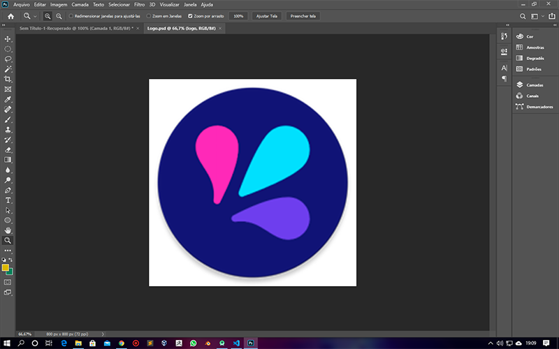
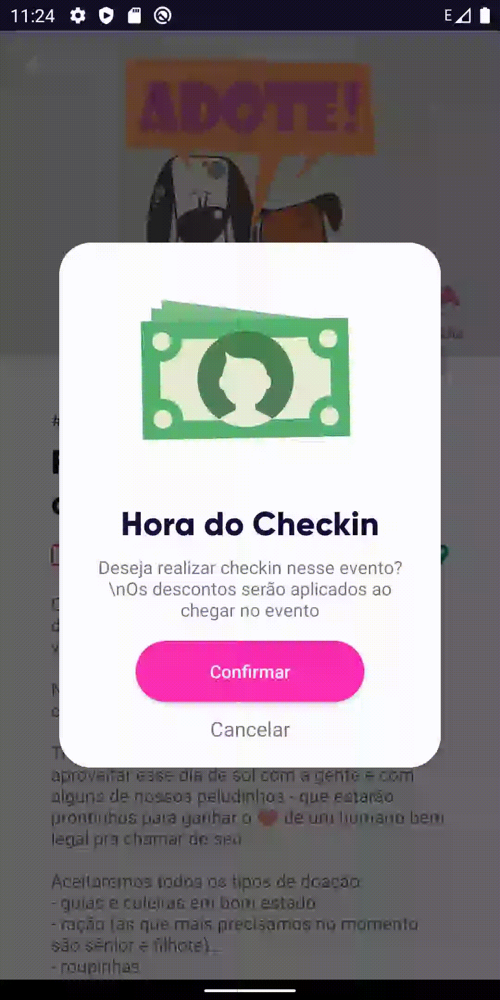
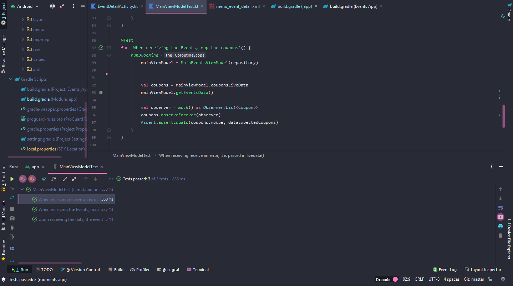

[![LinkedIn][linkedin-shield]][linkedin-url]

<!-- TEMPLATE DO README: https://github.com/othneildrew/Best-README-Template/blob/master/README.md -->

<br />
<p align="center">
    

  <h3 align="center">Events App - Desafio Sicred</h3>

  <p align="center">
   Aplicação feita para o desafio da Sicred para a DBC Company
    <br />
  </p>
</p>


## Sumário

* [Sobre o Projeto](#sobre-o-projeto)
* [Objetivos](#objetivos)
* [API de Eventos](#api-de-eventos)
  * [Eventos](#eventos)
  * [Checkin](#checkin)
* [Início do Projeto](#inicio-de-projeto)
* [Telas](#telas)
  * [Mini Cadastro](#mini-cadastro)
  * [Tela Inicial](#tela-inicial)
  * [Cupons](#tela-inicial)
  * [Evento](#evento)
  * [Checkin](#checkin)
* [Arquitetura](#arquitetura)
  * [Resumo](#resumo)
* [Injeção de dependências](#Injecaodedependencias)
* [Bibliotecas Usadas](#bibliotecas-usadas)
* [Testes](#testes)
* [Contato](#contato)


## Sobre o projeto


O desafio consiste em desenvolver um aplicativo na plataforma Android usando Kotlin que consumisse uma API com dados sobre eventos, seguindo alguns padrões como **MVVC**.
\
\
[![Product Name Screen Shot][product-screenshot]](/images/splash.png)
\
\

## Objetivos

* Criar uma aplicativo que consuma uma REST API e exiba uma listagem de eventos;
* Cada item da lista deve permitir acesso à detalhes do evento;
* No detalhe do evento é importante exibir suas informações e opções de check-in e compartilhamento.
* App deve compilar sem a necessidade de nenhum ajuste após ser clonado
* Suporte à API 19 e funcionar com a API 29
* Código deve ser escrito em Kotlin

## API de Eventos

A API possui uma rota para retorna uma lista de eventos e uma para realizar check-in

### Eventos

Retorna uma lista de eventos com o seguinte formato:


```json
 {
    "people": [
      {
        "id": "1",
        "eventId": "1",
        "name": "name 1",
        "picture": "picture 1"
      }
    ],
    "date": 1534784400000,
    "description": "O Patas Dadas estará ...",
    "image": "http://lproweb.procempa.com.br/pmpa/prefpoa/seda_news/usu_img/Papel%20de%20Parede.png",
    "longitude": -51.2146267,
    "latitude": -30.0392981,
    "price": 29.99,
    "title": "Feira de adoção de animais na Redenção",
    "id": "1",
    "cupons": [
      {
        "id": "1",
        "eventId": "1",
        "discount": 62
      }
    ]
  }
  ```
    
### Checkin

Pra realizar checkin, necessário um **POST** com o seguinte formato:
\
  ```json
{ "eventId": "1", "name": "Otávio", "email": "otavio_souza@..." }
  ```

## Início do Projeto

Primeiro elaborei uma logomarca usando o **Photoshop**, para representar o aplicativo:
 



## Telas

Em seguida, pensei no design das telas e no fluxo de navegação, usando conceitos de UI/UX e seguindo as regras do [Material Design](https://example.com):


### Mini Cadastro
Tela para o usuário inserir o seu nome e email que será usado para realizar o checkin, simulando um cadastro.
Ambas as informações são validadas antes de ser passado para a próxima tela:
\


### Tela Inicial
A tela principal do aplicativo exibe a lista de eventos e a lista de cupons disponíveis. Onde a tela é preparada caso haja problema na conexão e exibindo uma animação enquanto carrega usando a lib **Skeleton**.

> Aproveitando que a API traz uma lista de eventos, pensei em exibir os cupons de forma separada, chamando mais atenção

\
          

### Cupons

Ao clicar em um cupom, é exibido um popup com as informações de desconto e um atalho para o evendo:

\
        

### Evento

Na tela do evento, é exibida o título, descrição, data e localização do evento em um mapa usando a **API do Google Maps**, um botão para compartilhar o evento e um botão para realizar o checkin:

\
       

### Checkin

Para realizar o checkin é exibido um popup onde o usuário confirma se deseja realizar, em segui é feita o POST a API, mostrando a mensagem de sucesso ou falha:

\
                 


## Arquitetura
A arquitetura usada no projeto é a **Model View ViewModel - MVVM**, onde dentro da aplicação as camadas são divididas em *Model*, *View* e *ViewModel*

  
  
\
### Resumo

1. **Model:** Lógica envolvida nos domínios da aplicação (Event, Coupon, Checkin...)
2. **View:** Toda construção de telas, a camada de apresentação.
3. **ViewModel:** Coordena as operações entre a View e a camada Model.


## Injeção de dependências

Para injeção de dependências foi usada o **Koin**, para que de forma automática seja injetado os módulos do *ViewModel*, *Repositório*, *Retrofit*...

  
  
## Bibliotecas Usadas

Algumas bibliotecas externas foram usadas para ajudar no desenvolvimento:

* [Retrofit](https://square.github.io/retrofit/) - Para realizar chamadas a API.
* [Rounded Image View](https://github.com/vinc3m1/RoundedImageView) - Imageview com bordas arredondadas.
* [Skeleton](https://github.com/ethanhua/Skeleton) - Animações para loading.
* [Glide](https://github.com/bumptech/glide) - Usada para inserir imagens com qualidade em Imageview.
* [API Google Maps](https://cloud.google.com/maps-platform?hl=pt-br) - Usada para exibir a localização dos eventos.
* [Lottie](https://github.com/airbnb/lottie-android) - Usada para animações. (Animações usadas: [Lottie Files](http://lottiefiles.com/))
* [Flat Icon](https://www.flaticon.com/) - Ícones usados na aplicação.


## Testes

Para a realização de testes nos **ViewModel** foram usados o JUnit e Mockito:

 

## Contato

Fábio Júnior - [@fabi1junior](https://instagram.com/fabi1junior) - fabiojuniorpeq@gmail.com

Link do Projeto: [https://github.com/fabiioojr/Event-App-Sicred](https://github.com/fabiioojr/Event-App-Sicred)


[linkedin-shield]: https://img.shields.io/badge/-LinkedIn-black.svg?style=flat-square&logo=linkedin&colorB=555
[linkedin-url]: https://www.linkedin.com/in/fabiojuniorpeq/
[product-screenshot]: images/splash.png